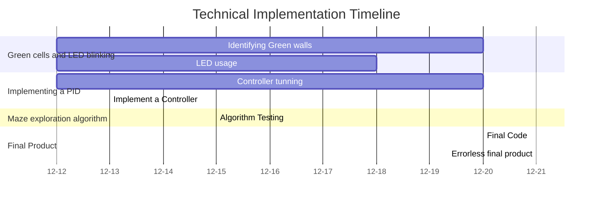

# Project Technical Development Report
**Project:** Webots Maze-Exploring Robot (2025)  
**Repository:** `TharinduHimantha/Robaroarz-2025---Maze-exploring-Robot-Webots-Simulation-`  
**Date Generated:** 2026-02-21 17:21 PM  

---

## 1. Project Development Timeline

## 2. Executive Summary
| Milestone Phase | Tasks Completed |
| :--- | :---: |
| Green cells and LED blinking | 2 |
| Implementing a PID | 2 |
| Maze exploration algorithm | 1 |
| Final Product | 2 |

## 3. Technical Task Index
| Ref | Milestone | Task Title | Completion Date |
| :--- | :--- | :--- | :--- |
| #6 | Green cells and LED blinking | [Identifying Green walls](#task-6) | 2025-12-20 |
| #7 | Green cells and LED blinking | [LED usage](#task-7) | 2025-12-18 |
| #9 | Implementing a PID | [Controller tunning](#task-9) | 2025-12-20 |
| #14 | Implementing a PID | [Implement a Controller](#task-14) | 2025-12-13 |
| #19 | Maze exploration algorithm | [Algorithm Testing](#task-19) | 2025-12-15 |
| #27 | Final Product | [Final Code](#task-27) | 2025-12-20 |
| #28 | Final Product | [Errorless final product](#task-28) | 2025-12-21 |

---

## 4. Detailed Engineering Logs

###  #6: Identifying Green walls
**Milestone Alignment:** `Green cells and LED blinking`  
**Cycle:** 2025-12-12 to 2025-12-20  

**Technical Objectives:** 
> Provide code for identifying green walls
You need to come up with a way to do that

**Implementation Source:** Pull Request #26  
| Timestamp | Contributor | Revision | Commit Message |
| :--- | :--- | :--- | :--- |
| 2025-12-20 21:06 | **Unknown** | `86a2200` | Merge pull request #24 from TharinduHimantha/main |
| 2025-12-20 21:13 | **Unknown** | `70bcb35` | The whole code |

---

###  #7: LED usage
**Milestone Alignment:** `Green cells and LED blinking`  
**Cycle:** 2025-12-12 to 2025-12-18  

**Technical Objectives:** 
> Provide code to do the necessary LED related things (just functions to turn them on/off, colour changes)
Do something unique
Read the document- delegate booklet and get the idea of what instances they need to be done

**Implementation Source:** Pull Request #26  
| Timestamp | Contributor | Revision | Commit Message |
| :--- | :--- | :--- | :--- |
| 2025-12-20 21:06 | **Unknown** | `86a2200` | Merge pull request #24 from TharinduHimantha/main |
| 2025-12-20 21:13 | **Unknown** | `70bcb35` | The whole code |

---

###  #9: Controller tunning
**Milestone Alignment:** `Implementing a PID`  
**Cycle:** 2025-12-12 to 2025-12-20  

**Technical Objectives:** 
> Tune in controller parameters for optimal performance

*Note: Task resolution managed via direct repository updates.*

---

###  #14: Implement a Controller
**Milestone Alignment:** `Implementing a PID`  
**Cycle:** 2025-12-13 to 2025-12-13  

**Technical Objectives:** 
> Implement a control theory mechanism to keep the robot at the center of the cell without rotations as best as possible.

*Note: Task resolution managed via direct repository updates.*

---

###  #19: Algorithm Testing
**Milestone Alignment:** `Maze exploration algorithm`  
**Cycle:** 2025-12-15 to 2025-12-15  

**Technical Objectives:** 
> Create and test a working algorithm to explore the whole maze.

**Implementation Source:** Pull Request #22  
| Timestamp | Contributor | Revision | Commit Message |
| :--- | :--- | :--- | :--- |
| 2025-12-15 13:41 | **Unknown** | `8fd3749` | Merge pull request #21 from TharinduHimantha/main |
| 2025-12-15 13:44 | **Unknown** | `35d36c5` | Added an Algorithm visualizer |

---

###  #27: Final Code
**Milestone Alignment:** `Final Product`  
**Cycle:** 2025-12-20 to 2025-12-20  

**Technical Objectives:** 
> The controller with all individual parts integrated

**Implementation Source:** Pull Request #26  
| Timestamp | Contributor | Revision | Commit Message |
| :--- | :--- | :--- | :--- |
| 2025-12-20 21:06 | **Unknown** | `86a2200` | Merge pull request #24 from TharinduHimantha/main |
| 2025-12-20 21:13 | **Unknown** | `70bcb35` | The whole code |

---

###  #28: Errorless final product
**Milestone Alignment:** `Final Product`  
**Cycle:** 2025-12-21 to 2025-12-21  

**Technical Objectives:** 
> A final algorithm that works without any

**Implementation Source:** Pull Request #29  
| Timestamp | Contributor | Revision | Commit Message |
| :--- | :--- | :--- | :--- |
| 2025-12-21 15:56 | **Unknown** | `21dc4b8` | 100 % Working Code |

---

